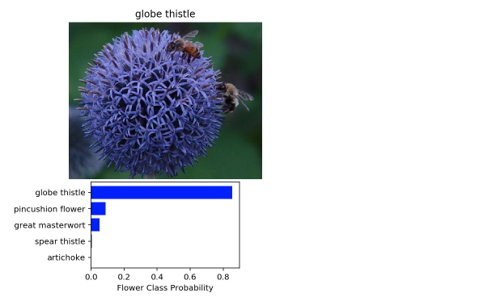
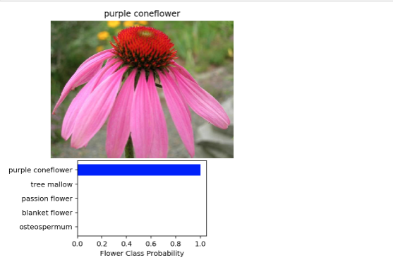
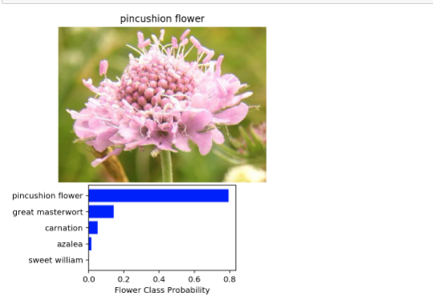
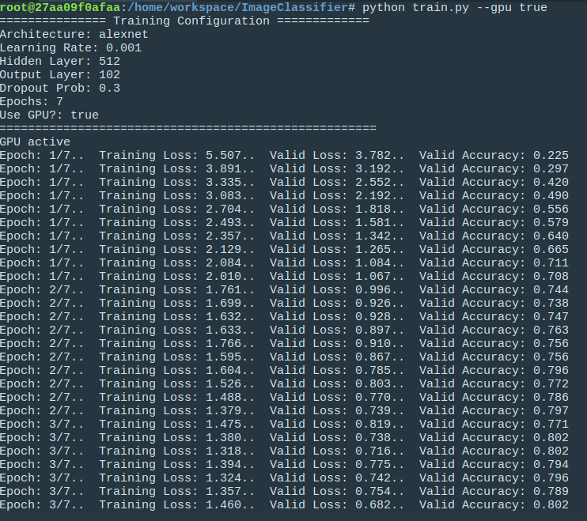
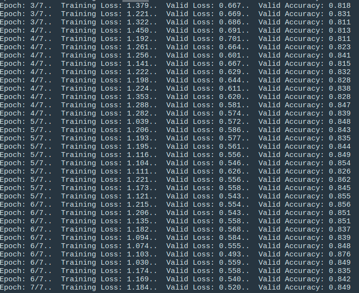
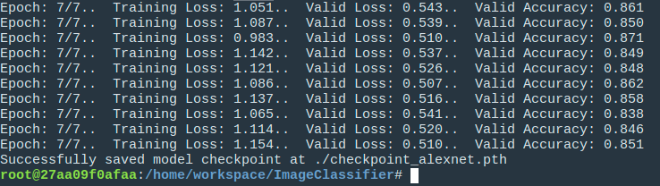
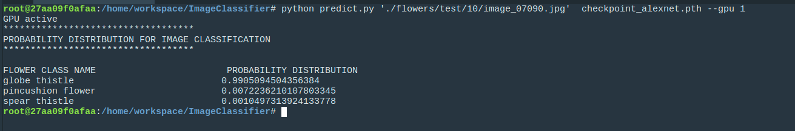
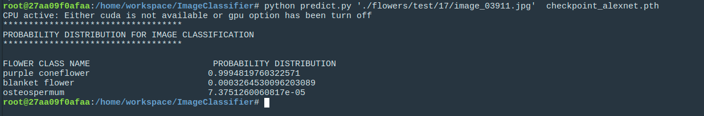
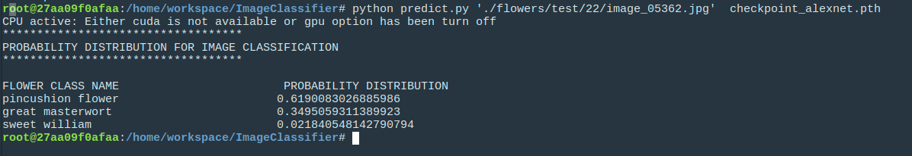

# AI Programming with Python Project


## Introduction
Going forward, AI algorithms will be incorporated into more and more everyday applications. For example, you might want to include an image classifier in a smart phone app. To do this, you'd use a deep learning model trained on hundreds of thousands of images as part of the overall application architecture. A large part of software development in the future will be using these types of models as common parts of applications.

In this project, you'll train an image classifier to recognize different species of flowers. You can imagine using something like this in a phone app that tells you the name of the flower your camera is looking at. In practice you'd train this classifier, then export it for use in your application. We'll be using this [dataset](http://www.robots.ox.ac.uk/~vgg/data/flowers/102/index.html) of 102 flower categories, you can see a few examples below.

>Project code for Udacity's AI Programming with Python Nanodegree program. In this project, students first develop code for an image classifier built with PyTorch,then convert it into a command line application.

## Part A: Developing an Image Classifier with Deep Learning
Part A was done on a jupyter notebook. The following steps were implemented
### Load the data

Dataset was split into three parts, training, validation and testing. A transformation was applied to the training set such as random rotation to 30 degrees, random resize and crop to `224x224` pixels and random horizontal flip. The training images are cropped to `224x224` pixels as it is required by the pre-trained networks.

The validation and testing set were just resized, cropped. However, all dataset was converted to tensor and normalized.

**NB:** `valid_transforms` and `test_transforms` are the same. It could be defined once and used for both validation and test transform. However, I decided to maintain individual definitions in case one has to be made different.

We also loaded the label mapping from category label to category name. This is used during the sanity check to return the predicted category names instead of the class labels.

When we check the first 10 items of the cat_to_name.json file, we say how the labels are mapped to category names. Also, the size of this dictionary will also determine the output layer of our network which is 102

```
[{'21': 'fire lily'},
 {'3': 'canterbury bells'},
 {'45': 'bolero deep blue'},
 {'1': 'pink primrose'},
 {'34': 'mexican aster'},
 {'27': 'prince of wales feathers'},
 {'7': 'moon orchid'},
 {'16': 'globe-flower'},
 {'25': 'grape hyacinth'},
 {'26': 'corn poppy'}]
```

### Building and training the classifier
Here, we build our network. Since the images are complex, it'll be difficult for us to build the network from scratch. Luckily, there are a lot of pre-trained models that can help us get rapid and better results. 

For a start, I loaded the pre-trained network `alexnet` from `torchvision.models`. The model looks as below:
```
AlexNet(
  (features): Sequential(
    (0): Conv2d(3, 64, kernel_size=(11, 11), stride=(4, 4), padding=(2, 2))
    (1): ReLU(inplace)
    (2): MaxPool2d(kernel_size=3, stride=2, padding=0, dilation=1, ceil_mode=False)
    (3): Conv2d(64, 192, kernel_size=(5, 5), stride=(1, 1), padding=(2, 2))
    (4): ReLU(inplace)
    (5): MaxPool2d(kernel_size=3, stride=2, padding=0, dilation=1, ceil_mode=False)
    (6): Conv2d(192, 384, kernel_size=(3, 3), stride=(1, 1), padding=(1, 1))
    (7): ReLU(inplace)
    (8): Conv2d(384, 256, kernel_size=(3, 3), stride=(1, 1), padding=(1, 1))
    (9): ReLU(inplace)
    (10): Conv2d(256, 256, kernel_size=(3, 3), stride=(1, 1), padding=(1, 1))
    (11): ReLU(inplace)
    (12): MaxPool2d(kernel_size=3, stride=2, padding=0, dilation=1, ceil_mode=False)
  )
  (classifier): Sequential(
    (0): Dropout(p=0.5)
    (1): Linear(in_features=9216, out_features=4096, bias=True)
    (2): ReLU(inplace)
    (3): Dropout(p=0.5)
    (4): Linear(in_features=4096, out_features=4096, bias=True)
    (5): ReLU(inplace)
    (6): Linear(in_features=4096, out_features=1000, bias=True)
  )
)
```

Second, I defined a new untrained feed-forward network as a classifier, using ReLU activation and dropouts = `0.3`. The classifier input layer should be the same as the pre-trained classifier or fc input layer. Here, my input layer is `9216`. However we could obtain this value with `model.classifier[1].in_features`. I have two hidden layers of `4096` and `1024` and my output layer was gotten the length of the category to name mapping dictionary.

My learning rate is `0.001` with `7 epochs`. After training, I got an accuracy on validation of `85%` and on the testing set, I had an accuracy of `72%`

### Save the checkpoint
After we have trained our model, we save it so that it can be load after for predictions and also to continue training.

For my checkpoint, I saved the following properties

- the model name ('arch')
- number of epoch ('epoch')
- dropout ('drop_out')
- classifier input layer (`input_layer`)
- the two hidden layers (`hidden_1` and `hidden_2`)
- the output layer (`network_output`)
- our defined classifier (`classifier`)
- classes to indices (`class_to_idx`)
- the model state dictionary (`state_dict`)


My checkpoint file has about `27mb` of size

### Loading the checkpoint
Here, we reload the checkpoint and rebuild the model so that it can be used for prediction or to continue training.

### Image Preprocessing
With the use of PIL, we load the image and use the transformation that we defined already for testing and we apply it to the image. This will resize and crop the image to `224x224` and also normalize it.

### Prediction
Here, I did a prediction of the class (or classes) of an image using the trained deep learning model. The image path used is `'./flowers/train/1/image_06734.jpg'` and I had the following top 5 predictions

```
([0.7554612159729004,
  0.13465215265750885,
  0.06158832460641861,
  0.018977297469973564,
  0.011072215624153614],
 ['1', '55', '51', '19', '86'])
```
Right now our predict function returns a set of probabilities and class labels. However, we can see that the highest probability is for the class label `1`.

### Sanity Checking
Here, I display an image along with the top 5 class names from the prediction result. This is where the category to name mapping dictionary becomes useful. The predict function returns probabilities and class labels, we use these class labels and obtain their corresponding class names. 

A check was done on 3 images and the following results were obtained:

#### Flower predicted as `Globe Thistle`


#### Flower predicted as `Purple Coneflower`


#### Flower predicted as `Pincushion Flower`


## Part B: Building the command line application

Now that you've built and trained a deep neural network on the flower data set, it's time to convert it into an application that others can use. Your application should be a pair of Python scripts that run from the command line. For testing, you should use the checkpoint you saved in the first part.

### Training
#### Basic Usage
` $ python train.py `

The above command will run the network on the default settings. We can see all argument parsers are defined as below:
```
    parser.add_argument('--data_dir', default='./flowers', type=str, help="data directory")
    parser.add_argument('--save_dir', default='./', type=str, help="directory to save checkpoints")
    parser.add_argument('--arch', default='alexnet', help='DNN models to use like: alexnet, vgg13')
    parser.add_argument('--hidden_layer', default=512, type=int, help='number of neurons in hidden layer')
    parser.add_argument('--output_layer', default=102, type=int, help='number of output layers')
    parser.add_argument('--learning_rate', default=0.001, type=float, help='learning rate')
    parser.add_argument('--drop_out', default=0.3, type=float, help='dropout probability')
    parser.add_argument('--epochs', default=7, type=int, help='number of epochs for training')
    parser.add_argument('--gpu', default="False", type=str, help='If GPU should be enabled')
    parser.add_argument('--print_every', default=10, type=int, help='Set number of steps after every print')
    
```
To chose a different setting for the parameters, for example, the command :

`python train.py --learning_rate 0.02 --drop_out 0.5 --gpu true`

will set the learning rate to `0.02`, the dropout to `0.5` and the gpu to active

The command I ran was:
`python train.py --gpu true` 

And I got the following output after training:




This gave me an accuracy on validation of about `85%`

### Predicting
#### Basic Usage
`$ python predict.py './flowers/test/17/image_03911.jpg' checkpoint_alexnet.pth`

The above command will run the network on the default settings to predict the image from the directory `'./flowers/test/17/image_03911.jpg'` using the checkpoint file `checkpoint_alexnet.pth` in the root directory.  We can see all argument parsers are defined as below:

```

    parser.add_argument('input', default='./flowers/test/17/image_03911.jpg', type=str, help="input flower image to predict")
    parser.add_argument('checkpoint', type=str, help='pre-trained model path')
    parser.add_argument('--top_k', default=3, type=int, help='default top_k results')
    parser.add_argument('--category_names', default='./cat_to_name.json', type=str, help='default category file')
    parser.add_argument('--gpu', default='False',type=str, help='If GPU should be enabled')
 
```

To test my command-line application, I ran the prediction on the same three test images that I ran on the jupyter notebook to be sure my app is functioning well. But this time, my `top_k` parameter was the default `3`. The main aim here is to find out if the app will be able to predict the actual flower image. I got the following results

#### Flower predicted as `Globe Thistle`


#### Flower predicted as `Purple Coneflower`


#### Flower predicted as `Pincushion Flower`



## Challenges
This was an interesting project with a lot of challenges, which even made it more awesome. I had the following challenges:

### To be able to adapt the app so that it can be trained on multiple pretrained models. 
Due to the diversity in the model structures, some models like `alaxnet` and `vgg` have the `classifier` property but other models like `resnet18` have the `fc` property. Also, for those models with `classifier` property, a few had a `dropout` as their first parameter followed by the linear convolution which contains the actual input layer(`in_features`) So it was difficult at first to handle these differences, but I wrote a function that could handle it:

```
def get_classifier_input_layer(model):
    # Get classifier or fc property of a model
    # Some models like alexnet have 'classifier' but models like resnet18 have 'fc'
    # Also, for models with classifier property, some start with a dropout. In this case, we get the in_feature of 
    # the second index which will represent the input layer
    try:
        input_layer = model.fc.in_features
    except AttributeError:
        try:
            input_layer = model.classifier[0].in_features
        except AttributeError:
            input_layer = model.classifier[1].in_features
        
    return input_layer
    
def get_classifier(model):
    # Get classifier or fc base on model types. 
    try:
        if model.fc:
            classifier = model.fc
    except AttributeError:
        classifier = model.classifier
    return classifier

def set_classifier(model, classifier):
    # Set classifier or fc base on model type
    try:
        if model.fc:
            model.fc = classifier
    except AttributeError:
        model.classifier = classifier
```

## Conclusion
Thank you very much Udacity for this awesome project. I really feel inspired and I will improve on this project to make it more robust with more features.

I look forward to having more awesome projects.

## References
[Image Classification with Transfer Learninig and PyTorch](https://stackabuse.com/image-classification-with-transfer-learning-and-pytorch/#settingupapretrainedmodel)

[argparse — Command-Line Option and Argument Parsing](https://pymotw.com/3/argparse/)

[PyTorch documentation](https://pytorch.org/docs/master/torchvision/models.html)

